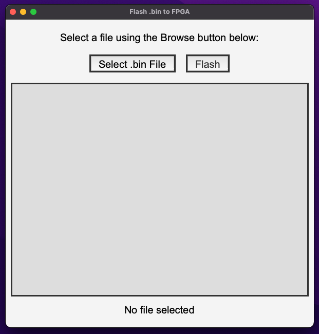

# FlashBinToFPGA - A simple tool to flash a binary file to an FPGA

This GUI application tool uses iceprog from [icestorm](https://clifford.at/icestorm) to flash a binary file to an FPGA on Windows, Linux and Mac. This is insteaded to make the process of flashing compiled FPGA code to an FPGA board easier, and to reduce the need to install the entire icestorm toolchain. This was built for ice40 FPGAs, but may work with other FPGAs.

 

#

## Installation
Please FULLY READ the steps below before following them.
### All Platforms
1. Begin by downloading the correct binary file for the flasher from github here:
    - https://github.com/Ellis-Brown/iceprog/releases/tag/Downloads for Mac/Windows
    - https://github.com/Ellis-Brown/iceprog/blob/main/InstallUbuntu_Binary for Ubuntu or other Linux systems 
2. Follow the needed platform specific installation steps as needed 
    - [Windows only](#windows-10--11-only)
    - [Mac only](#mac-only)
3. Test your program by downloading the example rgb_blink.bin file from [rgb_blink.bin](rgb_blink.bin), and use the flasher GUI to upload this to your FPGA board. It should have the built-in RGB LED blink after you complete the installation. 
    - If your program fails to flash, make sure you have plugged in the FPGA, installed the drivers necessary (Windows), and have selected a valid .bin file. Read the output message in the FlashToFPGA GUI to help understand the error. 

### WINDOWS 10 / 11 ONLY:
1. Unzip and extract the .zip file downloaded by double clicking the file in your downloads folder
    - You likely will want to move this folder to another location, such as your desktop.
2. Plug in your FPGA to your computer
3. Update the drivers (if needed) by following the installation guide, specifically on the section [libusb Driver Install](https://learn.adafruit.com/adafruit-ft232h-breakout/windows-setup#libusb-driver-install-2084509 )
    - Zadig tool is already packaged with the installation (zadig-2.8.exe) 
    - ONLY complete the libusb Driver Install section of this guide.
4. Open the FlashToFPGA.exe application. You are now ready to flash binary files! Finish with the [testing instructions above](#installation).

### MAC ONLY:
1. Run the installer (.dmg file), and drag and drop the application into the applications folder
2. The app must be approved when it is run for the first time. Follow these [security instructions from Apple](https://support.apple.com/guide/mac-help/open-a-mac-app-from-an-unidentified-developer-mh40616/mac) to enable the app to run. The app will be in your applications folder
    - The note at the bottom of the apple help page often solves your issue, please don't skip over it!
4. Open the application. You are now ready to flash binary files! Finish with the testing [testing instructions above](#installation).

## Usage
1. Open up the FlashToFPGA application. 
    - On Windows, this will be in a folder based on where you installed it. See how to install in the [install FPGA flash documentation](#installation).
    - On Mac, this should be in your applications folder on your computer. You should also be able to find this using Spotlight Search, by pressing Command + Space, then searching “FlashToFPGA.app”
    - On Ubuntu and other Linux platforms, this will be in a folder based on where you installed it. See how to install in the [install FPGA flash documentation](#installation).
2. Select your downloaded bin file
3. Press the flash button
4. __Make sure to read the log output in the flashing GUI screens__ to determine if your code flashed correctly. If you have issues, please read the [troubleshooting section](#troubleshooting) below.

## Troubleshooting
- Make sure your FPGA board is plugged into your computer. Only plug one FPGA board in at a time.
- (Windows only) Make sure you have the correct drivers installed 
- Make sure you have selected the correct .bin file
- Make sure you have selected the correct FPGA board
- Make sure you have installed the correct version of the flasher for your platform
- Make sure you have the correct permissions to run the flasher

## Contributing and further help
For any further help, feel free to raise an issue on this github repository, although this is not actively maintained. Pull requests are welcome. 

## Project Overview
- The GUI works by bundling iceprog with a simple GUI wrapper. 
- We used PyInstaller to build the GUI natively on every platform. The command used to run the installation process was `pyinstaller --onefile --icon "vhdl-icon.ico" -w --add-binary "iceprog.exe:." run-gui.py`
    - This assumes you have the app icon in a file called [vhdl-icon.ico](vhdl-icon.ico) and the iceprog binary in a file called [iceprog.exe](iceprog.exe). This iceprog binary must work on the platform where this command is run to build the GUI tool.
- The source code for the flasher can be found in [run-gui.py](run-gui.py)
- Notable files:
    - [run-gui.py](run-gui.py) - GUI source code
    - [get-iceprog.py](get-iceprog.py) - Script to download iceprog binary, and run it from the command line
    - [iceprog.exe](iceprog.exe) - Windows iceprog binary
    - [linux-iceprog](linux-iceprog) - Linux iceprog binary
    - [iceprog](iceprog) - Mac iceprog binary (M1 and Intel)
> Note: There is also a command line script to help students install the iceprog binaries locally, then run from the command line without the GUI tool. It is not officially supported. However, this accounts for the other files in the repository, and it is recommended that these files are not deleted. 

> Note: The flasher GUI does not successfully stream data live from iceprog to the GUI, and will only show your output after flashing is fully complete or fails. A fix was attempted, but it was deemed not worthy of solving at this time.
